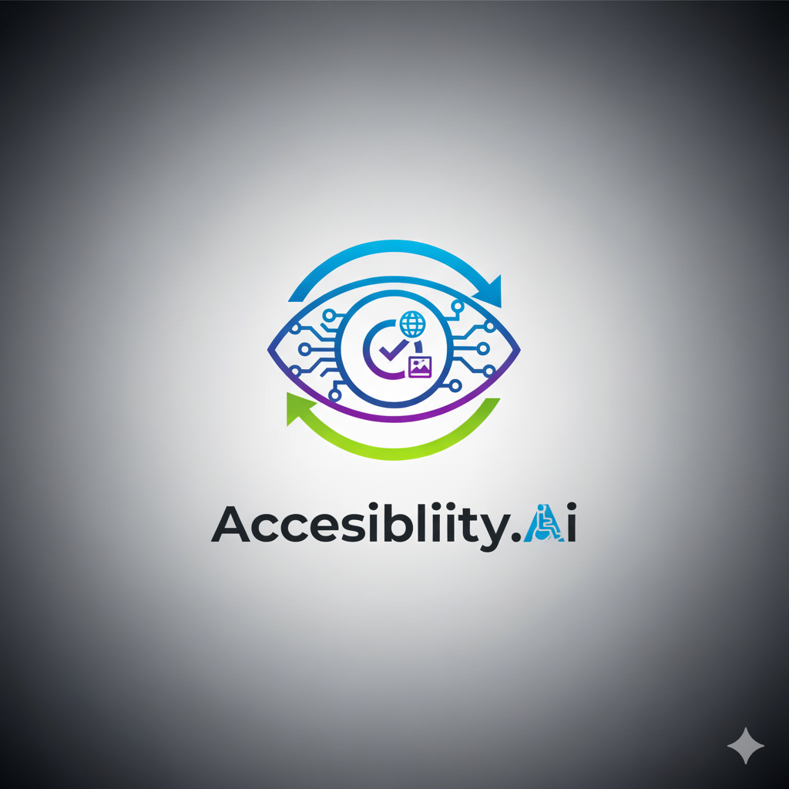

# PROJETO IHC - Ferramenta de Análise de Acessibilidade com IA

<div align="center">

</div>

---

## ✅ Sumário

* [Introdução](#introdução)
* [Sobre](#sobre)
* [Pré-requisitos](#pré-requisitos)
* [Instalação](#instalação)
* [Variáveis de ambiente](#variáveis-de-ambiente)
* [Executando localmente](#executando-localmente)
* [Build e produção](#build-e-produção)
* [Deploy (ex.: Vercel)](#deploy-ex-vercel)
* [Contribuidores](#contribuidores)

---
## Introdução

O projeto aplica os conceitos de Interação Humano-Computador (IHC) com foco em acessibilidade web, desenvolvendo uma ferramenta que avalia a acessibilidade de sites a partir do HTML e de imagens. O pocket funciona como fonte de conhecimento para a IA: ele contém os sumários de WCAG, NBR e do Guia de Boas Práticas para Acessibilidade Digital, elaborados pelo Grupo 7 a partir dos materiais disponibilizados pela professora Rejane Figueiredo. Com base nesse pocket, a IA realiza a análise e gera automaticamente um relatório de acessibilidade.

## Sobre

A aplicação utiliza IA generativa (Google Gemini) para automatizar a avaliação de acessibilidade de sites, a partir da análise de HTML ou imagens. Essa análise é realizada a partir do nosso pocket que foi feito com base nos sumários de WCAG, NBR e do Guia de Boas Práticas para Acessibilidade Digital. Esses sumários foram produzidos pelo Grupo 7 a partir dos conteúdos e materiais disponibilizados pela professora Rejane Figueiredo.

As principais funcionalidades incluem:

- Guia de Acessibilidade integrado.

- Análise pelo HTMl de um site.

- Análise por Imagem.

- Autenticação por chave de API.

- Gerenciamento de tokens.

- Geração e exportação de relatórios.

Explique em 2–3 linhas o objetivo do projeto, público-alvo e funcionalidades principais.

Exemplo:

> Aplicação Next.js que fornece uma interface para consulta de CPFs com opção de relatório completo pago via PIX.

---

## Pré-requisitos

Instale as ferramentas abaixo antes de começar:

* Node.js (recomendado: 18.x ou superior)
* npm (vem com o Node) ou yarn
* Git


## Instalação

1. Clone o repositório oficial:

```bash
git clone https://github.com/UnB-IHC/IHC-2025.2-Grupo7.git
cd IHC-2025.2-Grupo7
```

2. Acesse a pasta do front-end:

```bash
cd front-end
```

3. Acesse a pasta **front-api**:

```bash
cd front-api
```

4. Instale as dependências:

```bash
npm install
```

5. Crie o arquivo `.env.local` dentro da pasta **front-api**:

```bash
touch .env.local
```

6. Gere uma API Key no site: [https://aistudio.google.com/](https://aistudio.google.com/)

7. Dentro do arquivo `.env.local`, coloque:

```
GEMINI_API_KEY=chave_api
aqui substitua "chave_api" pela chave real"
```

8. Inicie o servidor de desenvolvimento:

```bash
npm run dev
```

---

## Executando localmente

Para rodar em modo de desenvolvimento:

```bash
npm run dev
# ou
# yarn dev
```

Abra `http://localhost:3000` no seu navegador.

---

## Deploy (ex.: Vercel)

1. Crie um projeto no Vercel e conecte ao repositório GitHub.
2. Configure a `Build command` (ex.: `npm run build`) e `Output directory` (Next.js trata automaticamente).
3. Adicione as variáveis de ambiente no painel do Vercel (`Environment Variables`).
4. Para deploy de branch específica, escolha a branch no dashboard ao criar o projeto — Vercel faz deploy automático por branch.

Dica: caso veja erro `A Project name can only contain up to 100 lowercase letters, digits, and the characters '.', '_', and '-'`, renomeie o projeto usando apenas caracteres permitidos.


---

## Dúvidas / Solução de problemas

* `Erro: EADDRINUSE` — outra aplicação está usando a porta 3000. Pare a outra ou troque a porta.
* `node: bad option: --openssl-legacy-provider` — atualize dependências ou ajuste flags de build.
* Problemas com chaves de API — verifique se as variáveis de ambiente estão corretas no ambiente de produção e no painel do provedor (ex.: Vercel).

---

## Contribuidores

<table>
  <tr>
    <td align="center"><a href="https://github.com/anawcarol"><br /><sub><b>Ana Carolina</b></sub></a><br />
    <td align="center"><a href="https://github.com/Brwnds"><br /><sub><b>Brenda Beatriz</b></sub></a><br />   
    <td align="center"><a href="https://github.com/GeovannaUmbelino"><br /><sub><b>Geovanna Umbelino</b></sub></a><br />  
    <td align="center"><a href="https://github.com/GFlyan"><br /><sub><b>Guilherme Flyan</b></sub></a><br />
    <td align="center"><a href="https://github.com/joaolobo10"><br /><sub><b>João Carlos Lobo</b></sub></a><br />
  </tr>
</table>
